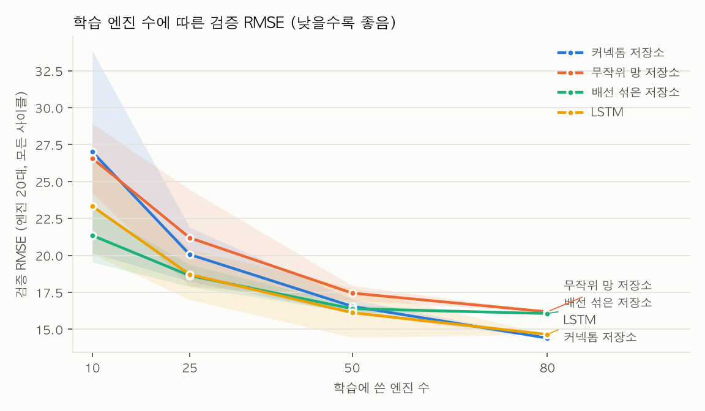
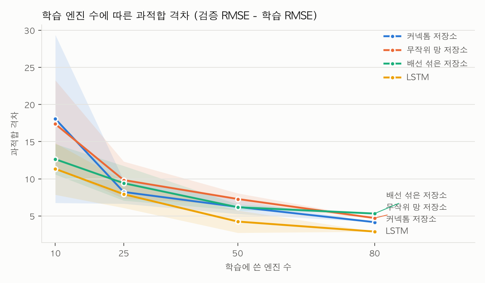
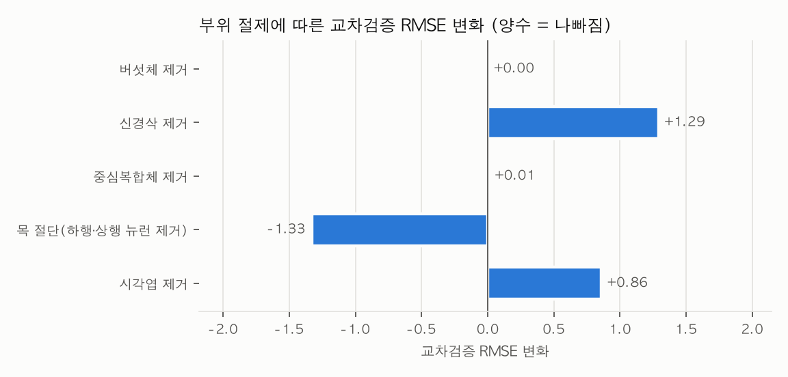

# 결과 보고서 2. 수컷 초파리 전체 신경망으로 예측한 항공엔진 잔여수명 (v0)

- 작성일: 2026-09-28
- 기획서: `proposal.md`
- 코드: 이 폴더(`cmapss/`), 공통 라이브러리 `../flycns/`, 실행 방법: `README.md`
- 실행 환경: 개발용 Mac(Apple M5 Pro, 메모리 24GB). 저장소는 CPU, 역전파 학습은 Mac 내장 GPU(MPS). WSL GPU는 쓰지 않았다.

## 요약

1. **만든 것:**
   - **M1(저장소):** 수컷 초파리 중추신경계 전체(뉴런 165,122개, 부호가 붙은 연결 2,454만 개)를 순환 신경망 구조로 그대로 쓰고, 출력층만 학습합니다.
   - **M2(딥러닝 버전):** 배선은 고정하고 세포 유형별 값 40,296개를 역전파로 학습합니다.
   - 모두 개발용 Mac에서 돌렸습니다.
2. **커넥톰 모델의 성능:** M1은 시험 RMSE 17.07 ± 0.20(시드 3개)으로, LSTM(14.38 ± 0.48)이나 30사이클 창을 쓴 선형 회귀(15.30)보다 나빴습니다.
3. **초파리 배선의 이점은 없었습니다.**
   - 같은 연결 수의 무작위 망도 17.07 ± 0.13으로 같았습니다.
   - **뉴런마다 연결 수를 유지하고 연결 상대만 섞은 망은 13.36 ± 0.27로 가장 좋았고**, LSTM보다도 나았습니다.
   - 가중치만 섞은 망도 15.55 ± 0.28로 커넥톰보다 좋았습니다.
   - 쌍체 부트스트랩(시험 엔진 100대)에서 커넥톰은 배선 섞은 망보다 RMSE가 3.80 [1.95, 5.63], 가중치 섞은 망보다 1.17 [0.10, 2.23] 유의하게 높았습니다. 무작위 망과는 차이가 없었습니다(−0.14 [−1.38, 1.13]).
4. **"커넥톰은 과적합에 강하다"는 가설은 이 데이터에서 성립하지 않았습니다.** 학습 엔진 10대에서 커넥톰의 과적합 격차는 18.16으로, 30사이클 선형 회귀(5.24), LSTM(11.34), 배선 섞은 망(12.69)보다 컸습니다.
5. **전체 CNS를 쓰는 이점도 없었습니다.**
   - 버섯체나 중심복합체를 없애도 결과가 거의 그대로였습니다.
   - **뇌와 신경삭을 잇는 목을 끊자 교차검증 RMSE가 14.39에서 13.06으로 좋아졌고**, 엔진 10대의 과적합 격차도 18.07에서 8.07로 줄었습니다.
   - 가장 많이 연결된 뉴런 1,500개만 쓴 부분 커넥톰(14.26)도 전체(14.39)와 비슷했습니다.
6. **M2(역전파 학습)는 개선을 만들지 못했습니다.**
   - 처음부터 학습하면 덜 학습됐습니다(커넥톰 22.11, 무작위 망 20.73).
   - M1 창 버전에서 출발하면, 커넥톰은 아주 작은 학습률에서도 발산해서 초기값(15.25)에 머물렀습니다. 무작위 망은 안정적으로 학습됐지만 초기값(15.08)에서 거의 움직이지 않았습니다(15.10).

| 가설(기획서 2장) | 결과 |
|---|---|
| H1 적은 데이터에서 커넥톰이 덜 과적합한다 | **기각.** 엔진 10대에서 과적합이 가장 컸다 |
| H2 이점은 배선에서 온다(배선을 섞으면 나빠진다) | **반대.** 배선을 섞으면 좋아졌다 |
| H3 전체 CNS가 부분 커넥톰보다 낫다 | **기각.** 뉴런 1,500개 부분 커넥톰과 비슷했고, 목을 끊으면 좋아졌다 |
| H4 유형별 값을 학습하면 LSTM과의 격차가 줄어든다 | **기각.** 학습이 덜 되거나 초기값에서 나아지지 않았다 |

## 1. 데이터와 평가 규약

- **데이터:** NASA C-MAPSS FD001. 학습 엔진 100대(20,631행), 시험 엔진 100대, 운전 조건 1개, 고장 유형 1개입니다. 엔진 수명은 128~362사이클(중앙 199)입니다.
- **입력:** 센서 14개와 운전 조건 3개를 학습 엔진 통계로 z-score 정규화했습니다. 변하지 않거나 거의 변하지 않는 센서 7개는 뺐습니다.
- **목표값:** 잔여수명을 125에서 잘랐습니다.
- **시험:** 각 시험 엔진의 마지막 사이클 예측을 RUL 파일의 정답과 비교해 RMSE와 NASA 점수를 냈습니다. NASA 점수는 늦은 예측에 벌점이 더 큽니다(Saxena 등 2008, a1 = 10, a2 = 13).
- **모델 선택:** 엔진 단위 5겹 교차검증 RMSE(모든 사이클)로 골랐습니다. 시험 점수는 선택에 쓰지 않았습니다.
- **데이터 양 실험:** 검증 엔진 20대를 고정하고, 나머지 80대에서 10, 25, 50, 80대를 뽑아 학습했습니다(80대 미만은 5번 반복). 과적합 격차는 검증 RMSE − 학습 RMSE입니다.
- **정규화 통계 주의:** 입력 정규화 통계는 학습 엔진 100대 전체에서 한 번 계산했습니다(라벨을 쓰지 않는 통계). 모든 모델에 똑같이 적용했습니다.

## 2. 모델

### M1: 커넥톰 저장소(배선·가중치 고정, 출력층만 학습)

```
센서 14개 + 운전 조건 3개 (사이클마다)
   -> 입력 가중치(고정, U(-1,1)) -> 감각 뉴런 9,453개
      온도 센서 -> 온도감각 뉴런, 회전수 -> 고유감각(신경삭), 압력 -> 촉각(신경삭),
      비율·블리드 -> 머리 기계감각, 운전 조건 -> 시각 (이 대응은 팀 설계)
   -> 수컷 CNS 전체 뉴런 165,122개, 연결 2,454만 개
      x(t+1) = (1 - a) x(t) + a tanh(W x(t) + 입력)
   -> 하행 뉴런 1,314 + 운동 뉴런 815 = 2,129개 상태
   -> ridge 회귀 -> 잔여수명
```

- **가중치:** 시냅스 수에 신경전달물질 부호를 붙였습니다(아세틸콜린 +, GABA·글루탐산·히스타민 −, 조절물질 0). 그다음 입력 비율 정규화(뉴런마다 받는 입력 합 1)를 하고 spectral radius를 맞췄습니다.
- **대조군:**
  - 무작위 망: 같은 연결 수, 시냅스 수 분포와 뉴런 부호 유지
  - 배선 섞은 망: 뉴런마다 들어오고 나가는 연결 수를 유지하고 연결 상대만 섞음
  - 가중치 섞은 망: 배선을 유지하고 시냅스 수만 섞음
- **설정 탐색:** 모든 망에 같은 범위를 썼습니다(spectral radius {0.9, 1.2} × 누설률 {0.1, 0.5}).

### M2: 세포 유형별 값 역전파 학습

flyvis(Lappalainen 등 2024) 방식입니다. 배선, 시냅스 수, 부호는 고정하고 다음을 학습했습니다.
- 세포 유형별 누설률과 휴지 상태: 유형 11,751개 + 유형 없는 뉴런 2,605개
- 입력 가중치 9,453개, 전체 이득, 출력층

학습 파라미터는 모두 40,296개로 LSTM(56,641개)과 비슷한 규모입니다. 기준 모델처럼 최근 30사이클 창을 0 상태에서 시작해 넣고, Mac 내장 GPU(MPS)에서 학습했습니다(배치 64, 배치당 약 5초).
- **처음부터 학습(cold):** 출력층을 0에서 시작, 학습률 3e-3
- **M1에서 출발(warm):** M1 설정으로 창 상태를 모아 출력층을 ridge로 맞춘 뒤 학습. 학습률은 출력층 1e-5, 동역학 1e-6(아래 4.3 참고)

### 기준 모델

선형 회귀(현재 사이클만 / 30사이클 창 펼침), LSTM, GRU, 1D-CNN입니다. 딥러닝 모델은 시드 3개로 학습하고, 고른 엔진의 20%로 조기 종료했습니다.

## 3. 결과

### 3.1 Phase A: 망 종류와 설정 (교차검증으로 고른 설정이 굵은 글씨)

| 망 | ρ | 누설률 | 교차검증 RMSE | 시험 RMSE | NASA |
|---|---|---|---|---|---|
| 커넥톰 | 0.9 | 0.1 | 14.60 | 17.09 | 479 |
| 커넥톰 | 0.9 | 0.5 | 17.59 | 15.84 | 522 |
| **커넥톰** | **1.2** | **0.1** | **14.39** | **16.78** | **470** |
| 커넥톰 | 1.2 | 0.5 | 17.01 | 15.71 | 395 |
| **무작위 망** | **0.9** | **0.1** | **14.97** | **16.92** | **421** |
| 무작위 망 | 0.9 | 0.5 | 17.41 | 16.42 | 601 |
| 무작위 망 | 1.2 | 0.1 | 15.57 | 15.99 | 390 |
| 무작위 망 | 1.2 | 0.5 | 16.25 | 16.52 | 548 |
| 배선 섞은 망 | 0.9 | 0.1 | 14.30 | 16.20 | 401 |
| 배선 섞은 망 | 0.9 | 0.5 | 15.82 | 16.06 | 427 |
| 배선 섞은 망 | 1.2 | 0.1 | 15.78 | 15.73 | 366 |
| **배선 섞은 망** | **1.2** | **0.5** | **13.53** | **12.98** | **266** |
| 가중치 섞은 망 | 0.9 | 0.1 | 14.10 | 16.78 | 423 |
| 가중치 섞은 망 | 0.9 | 0.5 | 17.39 | 16.22 | 557 |
| **가중치 섞은 망** | **1.2** | **0.1** | **13.56** | **15.61** | **361** |
| 가중치 섞은 망 | 1.2 | 0.5 | 15.34 | 14.77 | 383 |

**시드 반복(각 망의 최적 설정, 시드 3개).** 무작위·섞은 망은 망 자체와 입력 가중치가, 커넥톰은 입력 가중치만 시드에 따라 바뀝니다.

| 망 | 교차검증 RMSE (시드 0, 1, 2) | 시험 RMSE (시드 0, 1, 2) | 시험 평균 ± 표준편차 |
|---|---|---|---|
| 커넥톰 | 14.39, 14.53, 14.71 | 16.78, 17.23, 17.19 | 17.07 ± 0.20 |
| 무작위 망 | 14.97, 14.78, 14.63 | 16.92, 17.24, 17.04 | 17.07 ± 0.13 |
| **배선 섞은 망** | 13.53, 14.23, 13.59 | 12.98, 13.47, 13.62 | **13.36 ± 0.27** |
| 가중치 섞은 망 | 13.56, 13.74, 13.66 | 15.61, 15.18, 15.87 | 15.55 ± 0.28 |

같은 설정(ρ 1.2, 누설 0.5)끼리 비교해도 커넥톰은 15.71, 배선 섞은 망은 12.98이었습니다.

### 3.2 전체 비교 (시험 엔진 100대)

| 모델 | 학습 파라미터 | 시험 RMSE | NASA |
|---|---|---|---|
| 선형(현재 사이클만) | 18 | 20.84 | 1256 |
| 선형(30사이클 창) | 511 | 15.30 | 422 |
| **LSTM** (시드 3) | 56,641 | **14.38 ± 0.48** | 428 |
| GRU (시드 3) | 43,009 | 14.89 ± 0.86 | 536 |
| 1D-CNN (시드 3) | 8,993 | 18.85 ± 0.48 | 770 |
| M1 커넥톰 (시드 3) | 2,130 | 17.07 ± 0.20 | 482 |
| M1 무작위 망 (시드 3) | 2,130 | 17.07 ± 0.13 | 439 |
| **M1 배선 섞은 망** (시드 3) | 2,130 | **13.36 ± 0.27** | **279** |
| M1 가중치 섞은 망 (시드 3) | 2,130 | 15.55 ± 0.28 | 354 |
| M2 커넥톰, 처음부터 | 40,296 | 22.11 | 2354 |
| M2 무작위 망, 처음부터 | 40,296 | 20.73 | 1236 |
| M2 커넥톰, M1에서 출발 | 40,296 | 15.25 (학습이 초기값을 못 넘음) | 460 |
| M2 무작위 망, M1에서 출발 | 40,296 | 15.10 (초기값 15.08) | 433 |

- M1의 학습 파라미터는 출력층(2,129 + 1)뿐입니다.
- M2 "M1에서 출발"의 초기값은 M1과 같은 망을 30사이클 창으로 돌려 ridge로 맞춘 것입니다. 같은 커넥톰인데도 창 버전(15.25)이 엔진 전체 이력을 넣은 M1(16.78)보다 시험 점수가 좋았습니다.

| 쌍체 부트스트랩(시험 엔진 100대, 시드 0) | RMSE 차이 | 95% 구간 |
|---|---|---|
| M1 커넥톰 − M1 무작위 망 | −0.14 | [−1.38, +1.13] |
| M1 커넥톰 − M1 배선 섞은 망 | **+3.80** | **[+1.95, +5.63]** |
| M1 커넥톰 − M1 가중치 섞은 망 | **+1.17** | **[+0.10, +2.23]** |
| M2 커넥톰 − M2 무작위 망(처음부터) | +1.38 | [−1.12, +4.03] |
| M2 커넥톰 − M2 무작위 망(M1에서 출발) | +0.15 | [−0.70, +0.98] |

### 3.3 데이터 양 실험





검증 RMSE / 과적합 격차(검증 − 학습). M1은 시드 3개 × 뽑기 5번의 평균, 기준 모델은 뽑기 5번의 평균입니다.

| 모델 | 엔진 10대 | 25대 | 50대 | 80대 |
|---|---|---|---|---|
| M1 커넥톰 | 27.20 / 18.16 | 20.55 / 8.67 | 17.32 / 6.67 | 15.26 / 4.58 |
| M1 무작위 망 | 27.43 / 18.65 | 20.56 / 9.07 | 17.30 / 7.19 | 15.66 / 5.00 |
| M1 배선 섞은 망 | 21.10 / 12.69 | 18.82 / 9.63 | 16.69 / 6.63 | 15.04 / 5.10 |
| M1 가중치 섞은 망 | 24.02 / 14.51 | 20.07 / 8.77 | 16.05 / 5.92 | 13.15 / 4.15 |
| 선형(30사이클 창) | **19.35 / 5.24** | **17.94 / 3.41** | 17.03 / 1.58 | 16.83 / 1.26 |
| LSTM | 23.32 / 11.34 | 18.71 / 7.93 | 16.12 / 4.25 | 14.65 / 2.90 |
| GRU | 20.84 / 9.05 | 18.01 / 8.29 | **15.26 / 4.04** | 14.92 / 3.31 |
| 1D-CNN | 34.00 / 12.02 | 25.41 / 9.30 | 21.67 / 6.77 | 23.30 / 2.44 |

학습 엔진이 10대일 때 커넥톰과 무작위 망의 과적합 격차가 가장 컸습니다. 최적 설정을 엔진 100대 전체의 교차검증으로 골랐기 때문에, 정규화가 약하고 기억이 긴 설정(누설 0.1)이 뽑힌 영향도 있습니다. 누설 0.5 설정의 커넥톰은 엔진 10대에서 격차가 6.23~11.14로 작았습니다(Phase A 로그).

### 3.4 Phase B: 부호, 입력 대응, 부위 절제, 부분 커넥톰

모두 커넥톰 최적 설정(ρ 1.2, 누설 0.1, 시드 0: 교차검증 14.39, 시험 16.78)에서 하나씩만 바꿨습니다.

| 변경 | 교차검증 RMSE (변화) | 시험 RMSE (변화) | 엔진 10대 과적합 격차 |
|---|---|---|---|
| 글루탐산을 흥분성(+)으로 | 14.60 (+0.21) | 17.11 (+0.33) | 15.10 |
| 센서 → 감각 뉴런 무작위 대응 | 14.24 (−0.15) | 17.61 (+0.83) | 17.46 |
| 시각엽 제거(89,390개) | 15.25 (+0.86) | 17.73 (+0.95) | 24.51 |
| 버섯체 제거(4,064개) | 14.39 (0.00) | 16.78 (0.00) | 18.09 |
| 중심복합체 제거(2,950개) | 14.40 (+0.01) | 16.79 (+0.01) | 18.08 |
| 신경삭 제거(약 20,350개) | 15.68 (+1.29) | 17.06 (+0.28) | 15.00 |
| **목 절단(하행 1,314 + 상행 1,846)** | **13.06 (−1.33)** | 16.70 (−0.08) | **8.07** |
| 연결 많은 뉴런 50개만 | 17.10 (+2.71) | 17.16 (+0.38) | 8.89 |
| 연결 많은 뉴런 100개만 | 16.96 (+2.57) | 16.07 (−0.71) | 8.61 |
| 연결 많은 뉴런 700개만 | 14.88 (+0.49) | 16.56 (−0.22) | 14.24 |
| 연결 많은 뉴런 1,500개만 | 14.26 (−0.13) | 15.60 (−1.18) | 19.15 |



- 부분 커넥톰은 Costi 등(2025)처럼 남긴 뉴런 중 20%에 입력을 넣고 남긴 뉴런 전체를 출력으로 읽었습니다.
- **목 절단의 의미:** 하행 뉴런은 연결이 끊겨 활동이 0이 되고, 출력은 신경삭 쪽 감각 입력(회전수·압력)만 받는 운동 뉴런에서 나옵니다. 즉 "뇌 없이 몸 쪽 회로만" 쓴 모델이 더 나았습니다.

## 4. 해석

**확인한 사실(실측)**
- 실제 배선은 무작위 망과 같았고, 연결 수만 유지한 채 섞은 망보다 유의하게 나빴습니다.
- 버섯체와 중심복합체를 없애도 결과가 소수점까지 거의 같았습니다. 이 입력·출력 설정에서는 두 부위의 활동이 출력 뉴런에 거의 전달되지 않습니다.
- 목을 끊으면 좋아졌습니다. 뇌를 거친 신호는 이 과제에서 쓸모 있는 정보보다 과적합을 부르는 특징을 더 많이 더했습니다.
- 이득을 1.6 이상 올리면 버섯체 케니언 세포끼리의 흥분 고리가 입력 없이도 활동을 유지했습니다. M2(M1에서 출발)에서도 커넥톰만 작은 파라미터 변화에 발산했고, 무작위 망은 안정적이었습니다.

**해석(검증하지 않은 가설)**
- 실제 커넥톰에는 모듈 구조가 강합니다. 버섯체의 강한 흥분 고리나 시각엽의 기둥 구조 같은 것들이죠. 그래서 입력이 들어간 감각 경로를 따라 신호가 특정 회로에 갇히고, 출력 뉴런이 받는 특징의 다양성이 떨어졌을 수 있습니다.
- 배선을 섞으면 허브(연결이 많은 뉴런)는 남고 모듈 구조는 사라집니다. 그 결과 입력이 뇌 전체로 고르게 섞였을 수 있습니다. 허브가 없는 무작위 망은 커넥톰과 비슷했으니, **연결 수의 불균형은 도움이 되고 실제 배선 패턴은 방해가 된다**는 해석과 맞습니다.
- 이 방향은 선충 커넥톰에서 저장소 성능이 배선보다 가중치 규모와 spectral radius에 좌우됐다는 Churchland 등(2026)의 관찰과 같습니다. 반면 암컷 초파리 커넥톰이 무작위 망보다 과적합에 강했다는 Costi 등(2025)과는 다릅니다. 연결 선택(강한 연결만 vs 전체), 정규화, 과제가 달라서 직접 비교하기는 어렵습니다(5장).
- 초파리 신경계는 비행, 보행, 냄새 학습에 맞게 진화했습니다. 엔진 센서 시계열을 예측하는 데 그 배선이 특별히 유리할 이유는 처음부터 약했다고 보는 편이 정직합니다.

## 5. 한계

- **시드 수가 적습니다.** 저장소는 망마다 최적 설정에서 시드 3개, M2는 시드 1개입니다. 섞은 망이 커넥톰보다 좋았던 결과가 시드에 얼마나 흔들리는지는 3.1의 시드 표로만 확인했습니다.
- **FD001만 썼습니다.** 운전 조건이 여러 개인 FD002·FD004와 고장 유형이 두 개인 FD003은 하지 않았습니다.
- **입력 대응(센서 → 감각 뉴런)은 팀 설계입니다.** 선행 연구에 근거한 대응이 아닙니다(Phase B에서 무작위 대응과 비교).
- **M2 학습이 불안정했습니다.** 처음부터 학습하면 덜 학습됐고(시험 22.11), M1에서 출발하면 커넥톰 버전은 아주 작은 학습률에서도 발산했습니다. 학습률 예열, 유형별 값의 범위 제한, 더 긴 학습 등을 시도하지 않았습니다.
- **평가 규약에 따라 숫자가 달라집니다.** 교차검증(모든 사이클)으로 좋은 설정과 시험(마지막 사이클)에서 좋은 설정이 달랐습니다. 이 보고서는 시험 점수를 모델 선택에 쓰지 않았습니다.
- **Costi 등(2025)과 조건이 다릅니다.** 그 연구는 암컷 FlyWire 커넥톰, 연결 점수 100 이상의 강한 연결만, 글루탐산 흥분성, 인공 3체 문제를 썼습니다. 이 실험은 수컷 CNS 전체, 모든 연결(입력 비율 정규화), 글루탐산 억제성(기본), 실제 산업 데이터입니다.

## 6. 다음 단계

1. **시드를 늘려** 커넥톰과 섞은 망의 차이가 안정적인지 확인합니다(망마다 10개 이상).
2. **가중치 분포를 맞춘 대조군을 더 둡니다.** 이번 결과는 이점이 배선보다 가중치 크기·분포와 spectral radius 쪽에서 온다는 Churchland 등(2026)의 관찰과 방향이 같습니다. 부호 비율과 입력 비율 분포를 유지한 대조군이 필요합니다.
3. **M2를 안정화합니다.** 버섯체 흥분 고리 같은 불안정 모드를 먼저 진단하고, 유형별 값에 범위 제한을 두는 방식을 시도합니다.
4. **FD002~FD004로 넓힙니다.**
5. 수업 발표에서는 **"초파리 배선이 이 과제에 도움이 되는가"에 대한 음성 결과와 그 근거(대조군·시드·절제)**를 중심으로 구성하는 것이 정직합니다. 수업의 성공 기준(왜 실패했고 무엇을 바꿨는지 설명)에 잘 맞습니다.

## 산출물

| 경로 | 내용 |
|---|---|
| `results/states/` | 저장소 상태(설정별 npz, 약 270MB씩, 레포에는 없음). 출력층을 다시 맞출 때 재사용 |
| `results/readout/` | 저장소 설정별 지표와 데이터 양 곡선 |
| `results/baselines/` | 기준 모델 지표 |
| `results/m2/` | M2 지표와 학습된 가중치 |
| `results/summary.json`, `figures/` | 요약과 그래프 |
| `results/logs/` | 실행 로그(중단한 시도 포함) |
| `results/simulate/` | 시연(`simulate.py`) 결과: 시험 엔진별 사이클마다 예측한 잔여수명 |
