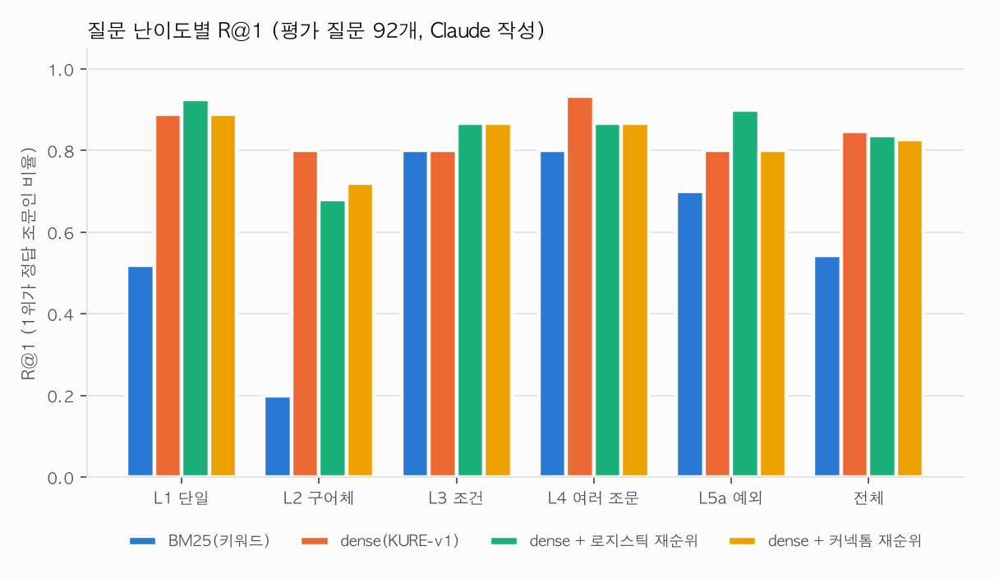

# 결과 보고서 1. 수컷 초파리 전체 신경망 기반 학사규정 질의응답 챗봇 (v0)

- 작성일: 2026-09-28
- 기획서: `proposal.md`
- 코드: 이 폴더(`regqa/`), 공통 라이브러리 `../flycns/`, 실행 방법: `README.md`
- 상태: 첫 구현(v0). 평가 질문은 Claude가 작성했다. 사람이 쓴 시험셋으로 다시 평가해야 한다(6장).

## 요약

1. **데이터:** 학사 관련 규정 64개를 규정관리시스템에서 수집해 markdown으로 바꿨습니다. 조문 2,032개로, 표와 규정 간 참조 496개를 보존했습니다. 챗봇 검색 대상은 학부 현행 규정 본문 조문 698개입니다.
2. **검색만으로 충분히 강했습니다.** 한국어 검색 인코더 KURE-v1의 dense 검색이 평가 질문 92개에서 R@1 0.85, R@5 0.98을 냈습니다. 원래 구상했던 키워드(BM25) 검색은 R@1 0.54였고, 구어체 질문(L2)에서는 0.20으로 크게 약했습니다.
3. **초파리 커넥톰은 정확도를 올리지 못했습니다.**
   - 질문과 조문을 각각 후각·시각 뉴런에 넣으면 커넥톰 재순위 모델은 후보 20개 중 무작위로 고르는 수준(R@1 0.04)이었습니다.
   - 비교 신호(q⊙a, |q−a|)를 넣으면 0.59로 올라갔습니다. 하지만 같은 입력을 선형으로 쓴 로지스틱 회귀(0.63), 무작위 망(0.52), 배선 섞은 망(0.54)과 **통계적으로 구별되지 않았습니다**(쌍체 부트스트랩 95% 구간이 모두 0을 포함).
   - dense 점수와 합쳐도 dense 단독(0.85)을 넘지 못했습니다(0.83).
4. **역전파로 학습한 버전(Stage 2)에서도 초파리 배선의 이점은 없었습니다.** 배선을 고정하고 세포 유형별 값과 출력층(파라미터 30,843개)을 학습하자 재순위 모델만으로 R@1 0.67까지 올라갔습니다(고정 저장소 0.59). 그런데 **같은 조건의 무작위 망은 0.75였고**, 검증 질문에서는 무작위 망이 유의하게 더 좋았습니다(역순위 차이 −0.023, 95% 구간 −0.040~−0.005). dense와 합친 최종 성능은 둘 다 dense와 같은 수준(0.85, 0.84)이었습니다.
5. **시연 도구(`ask.py`)는 쓸 만합니다.** 근거 조문, 학번별 표, 함께 봐야 할 조문을 보여주고, 범위 밖 질문은 거절합니다. 다만 이 기능들은 커넥톰이 아니라 검색 인코더와 규정의 참조 구조에서 나옵니다.

## 1. 데이터

| 항목 | 값 |
|---|---|
| 전체 공개 규정 | 353개(폐지 55개 포함) |
| 수집 범위 | 학사 관련 64개(학칙 편, 학사행정, 학생행정) |
| 조문 | 2,032개(본문 1,244, 부칙 788) |
| 규정 간 참조 | 496개(조 단위 85개 포함) |
| 챗봇 검색 대상 | 학부 현행 본문 조문 698개(46개 규정) |

- **검색 대상에서 뺀 것:** 대학원 규정, 부칙, 학칙(산업대)·학칙시행세칙(산업대)입니다. 산업대 규정은 산업대 시절 입학생에게만 적용되는 옛 규정인데, 현행 학칙과 거의 같은 문장이 많아 검색에서 현행 조문과 경쟁합니다.
- **표 보존:** 학칙시행세칙 제22조의1처럼 학번별 값이 표로 들어 있는 조문은 표를 그대로 남겨야 학번과 학점의 짝이 깨지지 않습니다. 변환기는 colspan과 rowspan을 펼쳐 markdown 표로 만듭니다.

### 평가 질문(v0)

Claude가 원문을 읽고 쓴 질문 102개입니다(`data/regulations/qa/eval_v0_claude.jsonl`). 정답 조문 ID는 모두 실제 조문과 대조해 확인했습니다.

| 난이도 | 개수 | 예 |
|---|---|---|
| L1 조문 하나 | 27 | 계절학기는 최대 몇 학점까지 신청할 수 있어? |
| L2 구어체·동의어 | 25 | 학사경고 몇 번 받으면 잘려? |
| L3 학번 등 조건 | 15 | 25학번 학사경고자는 수강학점이 몇 학점으로 제한돼? |
| L4 여러 조문 | 15 | 25학번인데 학사경고 받고 지원 프로그램을 안 들으면 몇 학점까지 들을 수 있어? |
| L5a 부정·예외 | 10 | 군휴학도 2년 휴학 한도에 포함돼? |
| L5b 범위 밖 | 10 | 학교 셔틀버스 시간표 알려줘 |

범위 밖 질문으로 쓸 주제는 규정에 정말 없는지 먼저 확인했습니다. 예를 들어 "주차"는 규정에 주차별(週次)이라는 뜻으로만 나왔고, "학생증"과 "대여"는 규정에 실제로 있어서 뺐습니다.

## 2. 모델

```
질문 -> KURE-v1(고정) -> dense 검색 상위 20개 후보
                          |
                          v
        재순위: (질문, 후보 조문) 쌍마다 관련성 점수
          - 로지스틱 회귀(뇌 없음)
          - 커넥톰 저장소: 입력 -> 감각 뉴런 -> 수컷 CNS 전체(뉴런 165,122, 연결 2,454만) 8스텝
                         -> 하행 뉴런 + 운동 뉴런 2,129개 활동 -> 로지스틱 회귀
          - 대조군: 무작위 망, 배선 섞은 망(연결 수 유지), 무작위 비선형 특징(망 없음)
                          |
                          v
        최종 점수 = dense 코사인 + λ × 재순위 점수 (λ는 검증 질문으로 선택, 0이면 dense 그대로)
```

- **커넥톰 가중치:** 시냅스 수에 신경전달물질 부호를 붙입니다(아세틸콜린 +, GABA·글루탐산·히스타민 −, 조절물질 0). 뉴런마다 받는 입력 합을 1로 맞추는 입력 비율 정규화를 한 뒤, spectral radius 1.2로 맞춥니다.
- **왜 입력 비율 정규화를 했나:** 처음에는 행렬 전체의 spectral radius(3,777.6)로만 나눴는데, 시냅스가 몰린 소수 연결이 이 값을 지배해서 출력 뉴런 활동이 0.0005 수준으로 사라졌습니다.
- **이득(gain) 범위:** 이득을 1.6 이상으로 올리면 버섯체 케니언 세포끼리의 흥분 고리가 입력 없이도 활동을 유지해서, 저장소 성질(입력을 잊는 성질)이 깨졌습니다. 1.2~1.3이 입력을 줄 때만 신호가 퍼지는 구간이었습니다.
- **학습 데이터:** 역클로즈 방식(조문 안의 한 문장을 질문으로 쓰고 그 조문을 정답으로 삼음)으로 학습 질문 1,164개, 검증 질문 277개를 만들었습니다. 음성 예는 검색 상위 후보에서 뽑은 어려운 오답 7개입니다.
- **답변 불가 기준:** 개발 질문 20개(범위 안 10, 밖 10)로 1위 점수 기준값을 정했습니다.

## 3. 결과

### 3.1 검색 방식별 (평가 질문 92개, 범위 밖 제외)

| 방식 | R@1 | R@5 | MRR | 구어체(L2) R@1 | 여러 조문(L4) 전부@5 |
|---|---|---|---|---|---|
| BM25(Kiwi 형태소) | 0.54 | 0.82 | 0.66 | 0.20 | 0.60 |
| **dense(KURE-v1)** | **0.85** | **0.98** | **0.90** | **0.80** | **0.73** |
| hybrid(RRF) | 0.72 | 0.89 | 0.80 | 0.40 | 0.67 |

BM25와 합친 hybrid가 dense 단독보다 떨어져서, 재순위 후보는 dense 상위 20개로 정했습니다.

### 3.2 재순위 모델

| 재순위 모델 | 입력 | 혼자 R@1 | 검증 MRR(역클로즈) | dense와 합친 R@1 |
|---|---|---|---|---|
| 없음(dense) | - | - | - | 0.85 |
| 로지스틱 회귀 | q⊙a, \|q−a\| | 0.63 | 0.820 | 0.84 |
| 무작위 비선형 특징(망 없음) | q, a | 0.12 | 0.219 | 0.85(λ=0) |
| 커넥톰 저장소 | q→후각, a→시각 | 0.04 | 0.272 | 0.85(λ=0) |
| **커넥톰 저장소** | q⊙a→후각, \|q−a\|→시각 | 0.59 | 0.824 | 0.83 |
| 무작위 망 저장소 | 같음 | 0.52 | 0.802 | 0.84 |
| 배선 섞은 저장소 | 같음 | 0.54 | 0.812 | 0.83 |

**쌍체 부트스트랩(질문 단위, 1만 회)**

| 비교 | 검증 RR 차이 [95% 구간] | 평가 R@1 차이 [95% 구간] |
|---|---|---|
| 커넥톰 − 무작위 망 | +0.022 [−0.003, +0.047] | +0.065 [−0.043, +0.174] |
| 커넥톰 − 배선 섞은 망 | +0.012 [−0.012, +0.037] | +0.043 [−0.065, +0.152] |
| 커넥톰 − 로지스틱 회귀 | +0.004 [−0.019, +0.029] | −0.043 [−0.163, +0.065] |



### 3.3 답변 불가 판정 (범위 밖 10개, 범위 안 92개)

| 방식 | 범위 밖 거절 | 범위 안 오거절 |
|---|---|---|
| dense 점수 기준 | 0.90 | 0.07 |
| dense + 커넥톰 재순위 | 1.00 | 0.05 |
| dense + 로지스틱 재순위 | 0.90 | 0.05 |

범위 밖 질문이 10개뿐이라 이 차이(질문 1개)를 성능 차이로 볼 수는 없습니다.

### 3.4 Stage 2: 역전파 학습

비교 신호 입력(`_ix`)과 같은 고정 입력 투영을 쓰고, 커넥톰 배선은 고정한 채 다음을 Mac 내장 GPU(MPS)에서 학습했습니다.
- 세포 유형별 누설률과 휴지 상태(유형 11,751개 + 유형 없는 뉴런 2,605개)
- 전체 이득, 출력층(하행+운동 뉴런 2,129개 → 점수)

손실은 역클로즈 질문마다 정답 1개와 오답 7개 중 정답을 고르는 softmax 교차 엔트로피이고, 6 epoch 중 검증 MRR이 가장 좋은 시점을 골랐습니다.

| Stage 2 | 학습 파라미터 | 최고 검증 MRR(epoch) | 재순위만 R@1 | 재순위만 MRR | dense와 합친 R@1 |
|---|---|---|---|---|---|
| 커넥톰 | 30,843 | 0.830 (4) | 0.67 | 0.79 | 0.85 (λ=0) |
| 무작위 망 | 30,843 | **0.853 (2)** | **0.75** | **0.82** | 0.84 (λ=0.1) |

| 비교(재순위만) | 검증 RR 차이 [95% 구간] | 평가 R@1 차이 [95% 구간] |
|---|---|---|
| Stage 2 커넥톰 − 무작위 망 | **−0.023 [−0.040, −0.005]** | −0.076 [−0.174, +0.022] |

- 학습 손실도 무작위 망이 훨씬 빨리 떨어졌습니다(2 epoch 손실 0.459 대 1.128).
- 무작위 망에서 "세포 유형"은 원래 뉴런의 유형 이름을 그대로 빌린 묶음일 뿐, 배선과는 관계가 없습니다. 그래도 같은 개수의 파라미터를 같은 방식으로 공유합니다.

## 4. 해석

- **질문과 조문을 따로 넣으면 실패하는 이유:** 관련성을 판단하려면 두 벡터를 곱하는 상호작용(1024×1024 쌍선형 관계)이 필요합니다. 고정된 망과 선형 출력층으로는 이를 표현하기 어렵습니다. 망 없이 무작위 비선형 특징만 쓴 대조군(0.12)도 같은 이유로 실패했습니다.
- **비교 신호를 넣으면 되는 이유와 그 한계:** 비교 신호를 넣으면 관련성 정보가 이미 입력에 들어 있습니다. 이때 커넥톰을 거친 모델(0.59)은 입력을 선형으로 쓴 모델(0.63)보다 나아지지 않았습니다. 즉 이번 설정에서 **초파리 배선은 정보를 더하지 못하고 옮기기만 했습니다.**
- **학습시켜도 마찬가지였습니다:** 배선을 고정하고 유형별 값을 학습하면 성능이 오르긴 했지만, 같은 방식으로 학습한 무작위 망이 더 잘 배웠습니다. 초파리 배선이 이 과제에서는 오히려 학습을 방해하는 제약으로 작용했을 가능성이 있습니다(예: 입력 비율 정규화 후 신호가 특정 경로로만 흐름).
- **정확도를 만든 것:** 한국어 검색 인코더와 규정 구조(표 보존, 참조 링크)였습니다. 원래 구상했던 키워드 챗봇과 비교하면 이 두 가지가 가장 큰 개선이었습니다.

## 5. 한계

- **평가 질문을 Claude가 작성했습니다.** 표현이 원문과 가까워 실제 학생 질문보다 쉬울 수 있습니다. dense R@5가 0.98로 거의 천장이라 재순위 모델이 보여줄 여지도 좁았습니다.
- **학습 신호가 실제 질문과 다릅니다.** 역클로즈 질문은 조문 문장 그 자체라, 실제 질문 형태와 차이가 큽니다.
- **범위 밖 질문이 10개뿐입니다.**
- **부칙을 검색 대상에서 뺐습니다.** 학번별 경과조치가 본문 표에 없고 부칙에만 있는 경우(예: 학칙시행세칙 부칙의 "제16조의 졸업학점은 2025학번 신·편입생부터 적용")는 답하지 못할 수 있습니다.
- **티노랑과 비교하지 않았습니다.**
- **별표·별지(HWP)는 변환하지 않았습니다.**

## 6. 다음 단계 (팀 작업)

1. 사람이 쓴 시험 질문 300개 이상으로 다시 평가합니다(기획서 4.2절). 팀원이 아닌 학생의 질문을 받고, 시험셋은 개발 중에 열어보지 않습니다.
2. 같은 시험 질문 일부를 티노랑에 물어 참고 비교합니다.
3. 부칙 경과조치를 본문 조문에 연결합니다(부칙이 가리키는 조 번호로 연결 가능).
4. 커넥톰을 계속 핵심으로 둘지 정합니다. 이번 결과로는 **챗봇 정확도를 위해서라면 커넥톰은 필요하지 않습니다.** 커넥톰을 유지하려면 "초파리 배선이 언어 과제에서 무엇을 하는가"를 묻는 분석 과제로 성격을 바꾸는 편이 정직합니다.

## 산출물

| 경로 | 내용 |
|---|---|
| `data/regulations/` | 원본 HTML, markdown, 조문 JSONL, 평가·개발 질문 |
| `results/retrieval_baselines.json` | 검색 방식별 지표 |
| `results/rerank_*.json` | 재순위 모델별 지표 |
| `results/paired_bootstrap.json`, `paired_bootstrap_stage2.json` | 쌍체 부트스트랩 |
| `results/stage2/` | Stage 2 결과와 학습된 가중치 |
| `results/summary.json`, `figures/` | 요약과 그래프 |
| `ask.py` | 시연 도구 |
